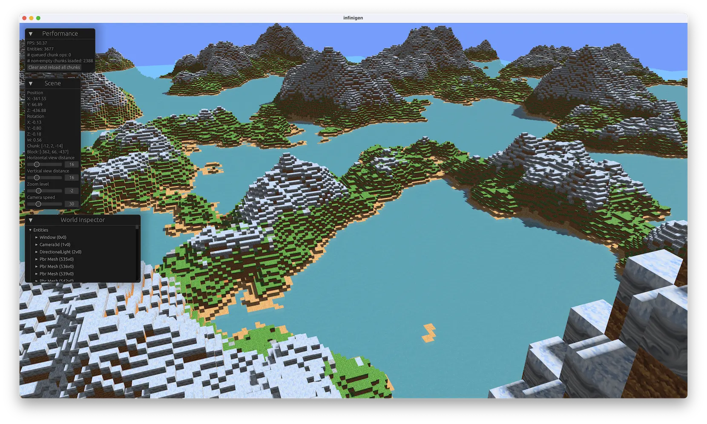

# infinigen [](https://github.com/jameshiew/infinigen/actions/workflows/ci.yml)

Minecraft-like procedural generation using the [Bevy game engine](https://bevyengine.org/).

- chunks along all axes (X, Y and Z)
- adjustable zoom level for viewing a world at different levels of detail




## Why?

This is a sandbox for experimenting with Bevy and efficient chunk rendering, and trying out different things in Rust. There are no gameplay elements like physics or editing blocks. Eventually I'd like to implement chunk generation and meshing on the GPU and distance based LOD (level of detail) to maximize the number of chunks that can be loaded as fast as possible. At minimum, I'm keeping this code up to date with the latest Bevy version as new versions are released.

## Quickstart

Make sure [OS dependencies for Bevy](https://bevyengine.org/learn/quick-start/getting-started/setup/#installing-os-dependencies) are installed.

These commands should be run from within the root directory of the repo in order to pick up assets, otherwise block textures will be replaced with colours.

```shell
cargo run --release # best performance
cargo run --release --features jemalloc  # on macOS/Linux
```

or

```shell
cargo run --features bevy/dynamic_linking  # compiles fastest
```

### Controls

- <kbd>W</kbd><kbd>A</kbd><kbd>S</kbd><kbd>D</kbd> - to move around
- <kbd>Space</kbd> - ascend
- <kbd>Shift</kbd> - descend
- <kbd>F3</kbd> - toggle wireframes
- <kbd>F7</kbd> - toggle debug panels

### Configuration

See `config.example.yml` for what can be configured. Pass the path to a configuration file when launching.

```shell
cargo run --release -- --config config.example.yml
```

Specific settings can also be overridden via environment variables.

```shell
INFINIGEN_WORLD=Flat cargo run --release
```

## Development

All textures are derived from images generated with [Midjourney](https://midjourney.com).

Simplest way to change how the world generates is to edit [crates/extras/src/worldgen/mountain_islands.rs](crates/extras/src/worldgen/mountain_islands.rs).
